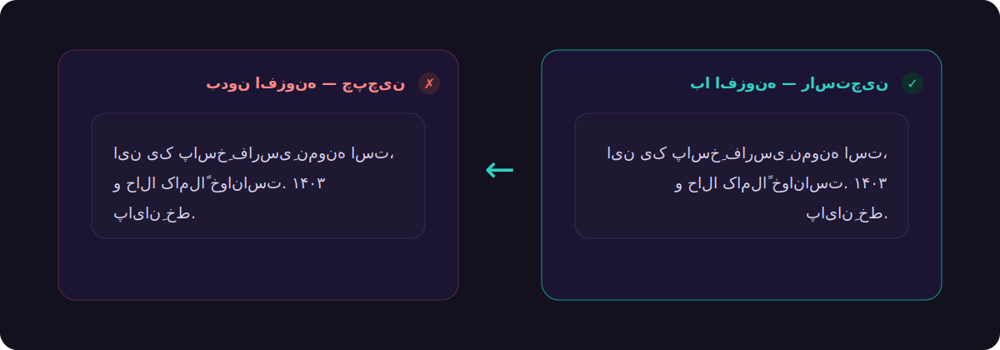

<div align="center">


<br>

[](#)
[](#)
[](#)
[](#)

<br>



</div>

<br>

<div dir="rtl">

## ماجرا از چه قراره؟

اگه فارسی‌زبونی و زیاد با چت‌بات‌های هوش مصنوعی کار می‌کنی، حتماً این درد رو می‌شناسی: متن فارسی **چپ‌چین** نمایش داده می‌شه و خوندنش عذاب‌آوره.

**راست‌چین‌ساز** این مشکل رو از ریشه حل می‌کنه و یه قدم جلوتر می‌ره: فونت تمیز، اصلاح خودکار تایپ، خواندن با صدا، خروجی گرفتن از گفتگو و کلی ابزار دیگه — همه‌ش بدون اینکه حتی یه دسترسیِ اضافه ازت بگیره (فقط `storage` برای ذخیره‌ی تنظیمات).

<div align="center">

</div>

<br>

## ✨ امکانات — یه گشت سریع

### 🎨 خوانایی و تایپوگرافی
- **راست‌چین خودکار** متن فارسی/عربی/عبری در پیام‌ها و کادر تایپ — حتی روی پاسخ‌هایی که لحظه‌به‌لحظه تایپ می‌شن.
- **فونت وزیرمتن** که آفلاین داخل خود افزونه جا گرفته (بدون نیاز به اینترنت).
- کنترل **اندازه‌ی متن** و **فاصله‌ی خطوط** با اسلایدر.
- **حالت تمرکز**: ستون گفتگو رو پهن‌تر و وسط‌چین می‌کنه و حواس‌پرتی رو کم می‌کنه.

### ⌨️ تایپ فارسی، همون‌طور که باید باشه
- اصلاح خودکار `ك→ک` و `ي→ی` همون لحظه‌ی تایپ.
- **نیم‌فاصله** با `Shift + Space`.
- **مرتب‌سازی یک‌کلیکی** کل متن کادر تایپ (نیم‌فاصله‌ی هوشمند، حذف فاصله‌های اضافه).
- **تبدیل ارقام** فارسی ↔ لاتین در پیام‌ها.

### 🛠 ابزارهای روزمره
- **نوار انتخاب متن**: هر متنی رو انتخاب کنی، یه نوار کوچیک بالاش میاد — 🔊 خواندن با صدا، 📋 کپی، 🔖 ذخیره، ⚡ ذخیره به‌عنوان پرامپت.
- **دیکته‌ی صوتی فارسی**: به‌جای تایپ، حرف بزن.
- **کتابخانه‌ی پرامپت**: پرامپت‌های پرتکرارت رو ذخیره کن و با یه کلیک توی چت درج کن.
- **شمارنده‌ی متن**: تعداد کلمه و نویسه‌ی کادر تایپ.

### 🔎 جستجو و خروجی
- **جستجو در گفتگو** با هایلایت زنده و حرکت بین نتیجه‌ها.
- **خروجی گرفتن** از کل گفتگو به `Markdown`، `متن ساده` یا `PDF`.
- **ذخیره‌ها**: تیکه‌های نشان‌شده همیشه دمِ دستت.

<br>

## 🚀 نصب

### روش ۱ — از فروشگاه کروم (ساده‌ترین راه)

کافیه توی وب‌استور کروم عبارت **`rtl-fixer-ai`** رو سرچ کنی، یا روی دکمه‌ی زیر بزنی:

<div align="center" dir="ltr">

[](https://chromewebstore.google.com/search/rtl-fixer-ai)

</div>

۱. وارد صفحه‌ی افزونه شو.
۲. روی **Add to Chrome / افزودن به کروم** بزن.
۳. تمام — آیکون ↹ کنار نوار آدرس ظاهر می‌شه. یه چت باز کن و لذت ببر.

---

### روش ۲ — نصب دستی (Load unpacked)

اگه می‌خوای آخرین نسخه رو مستقیم نصب کنی:

۱. آخرین `rtl-fixer.zip` رو از بخش **[Releases](../../releases)** دانلود و از حالت فشرده خارج کن.
۲. توی مرورگر برو به:

```
chrome://extensions
```

۳. گوشه‌ی بالا، **Developer mode** رو روشن کن.
۴. روی **Load unpacked** بزن و پوشه‌ی `rtl-fixer` رو انتخاب کن (همونی که `manifest.json` مستقیم داخلشه).

> روی **Edge** و **Brave** هم دقیقاً همین مراحله. برای **Firefox** از مسیر `about:debugging` و گزینه‌ی *Load Temporary Add-on* استفاده کن.

<br>

## 🎹 شورتکات‌ها

| کلید | کاری که می‌کنه |
|------|----------------|
| `Alt` + `R` | روشن/خاموش کردن راست‌چین |
| `Alt` + `F` | جستجو در گفتگو |
| `Alt` + `N` | مرتب‌سازی متن کادر تایپ |
| `Alt` + `D` | دیکته‌ی صوتی |
| `Alt` + `G` | حالت تمرکز |
| `Alt` + `E` | خروجی Markdown |
| `Alt` + `P` | خروجی PDF |
| `Shift` + `Space` | درج نیم‌فاصله |

<br>

## 🌐 سایت‌های پشتیبانی‌شده

<div align="center" dir="ltr">

`Claude` · `ChatGPT` · `Gemini` · `AI Studio` · `Copilot` · `Perplexity` · `DeepSeek` · `Grok` · `Poe`

</div>

افزودن سایت جدید هم آسونه؛ کافیه آدرسش رو به `matches` توی `manifest.json` اضافه کنی.

<br>

## 👤 سازنده

این افزونه رو از صفر خودم نوشتم — با وسواس روی جزئیاتِ فارسی و تجربه‌ی کاربری.

اگه به یه **افزونه‌ی مرورگر**، **وب‌اپ**، یا یه **تجربه‌ی تعاملی / سه‌بعدیِ اختصاصی** برای کسب‌وکارت نیاز داری، از ایده تا تحویل کنارتم. بزن بریم حرف بزنیم:

<div align="center" dir="ltr">

**سامان ولی‌خانی**

[](https://t.me/samanvalikhani)

</div>

<br>

## 📄 لایسنس

کدِ افزونه آزاد و متن‌باز است. فونت **Vazirmatn** تحت لایسنس [SIL OFL](fonts/OFL.txt) همراه افزونه توزیع شده.

</div>

<div align="center">

<sub>اگه به کارت اومد، یه ⭐ بذار — انگیزه‌ی نسخه‌های بعدیه.</sub>

</div>
