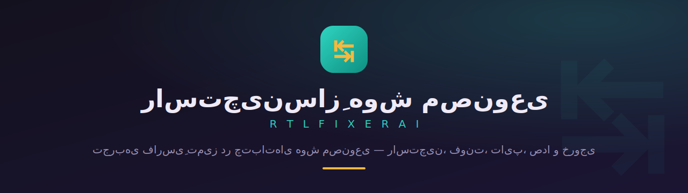
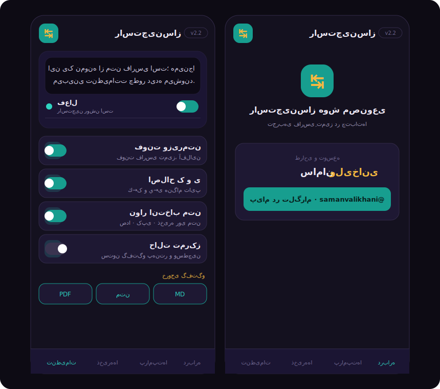

<div align="center">



<br>

[](#)
[](#)
[](#)

</div>

<br>

<div align="center">

### 📑 از کجا شروع کنم؟

**[✨ امکانات](#features)** &nbsp;•&nbsp; **[📥 نصب قدم‌به‌قدم](#install)** &nbsp;•&nbsp; **[🎹 شورتکات‌ها](#shortcuts)** &nbsp;•&nbsp; **[🌐 سایت‌ها](#sites)** &nbsp;•&nbsp; **[📞 ارتباط با من](#contact)**

</div>

<br>

<div dir="rtl">

## ماجرا از چه قراره؟

اگه فارسی‌زبونی و زیاد با چت‌بات‌های هوش مصنوعی کار می‌کنی، حتماً این درد رو می‌شناسی: متن فارسی **چپ‌چین** نمایش داده می‌شه و خوندنش عذاب‌آوره.

**راست‌چین‌ساز** این مشکل رو از ریشه حل می‌کنه و یه قدم جلوتر می‌ره: فونت تمیز، اصلاح خودکار تایپ، خواندن با صدا، خروجی گرفتن از گفتگو و کلی ابزار دیگه — بدون اینکه حتی یه دسترسیِ اضافه ازت بگیره.

<div align="center">

</div>

<br>

<a id="features"></a>

## ✨ امکانات — یه گشت سریع

### 🎨 خوانایی و تایپوگرافی
- **راست‌چین خودکار** متن فارسی/عربی/عبری در پیام‌ها و کادر تایپ — حتی روی پاسخ‌هایی که لحظه‌به‌لحظه تایپ می‌شن.
- **فونت وزیرمتن** که آفلاین داخل خود افزونه جا گرفته.
- کنترل **اندازه‌ی متن** و **فاصله‌ی خطوط**.
- **حالت تمرکز**: ستون گفتگو رو پهن‌تر و وسط‌چین می‌کنه.

### ⌨️ تایپ فارسی
- اصلاح خودکار `ك→ک` و `ي→ی`.
- **نیم‌فاصله** با `Shift + Space`.
- **مرتب‌سازی یک‌کلیکی** کل متن کادر تایپ.
- **تبدیل ارقام** فارسی ↔ لاتین.

### 🛠 ابزارهای روزمره
- **نوار انتخاب متن**: 🔊 خواندن با صدا، 📋 کپی، 🔖 ذخیره، ⚡ ذخیره به‌عنوان پرامپت.
- **دیکته‌ی صوتی فارسی**.
- **کتابخانه‌ی پرامپت**: ذخیره و درج با یک کلیک.
- **شمارنده‌ی متن**.

### 🔎 جستجو و خروجی
- **جستجو در گفتگو** با هایلایت زنده.
- **خروجی گرفتن** به `Markdown`، `متن ساده` یا `PDF`.
- **ذخیره‌ها**: تیکه‌های نشان‌شده همیشه دمِ دستت.

<br>

<a id="install"></a>

## 📥 نصب — قدم به قدم

نگران نباش، خیلی ساده‌ست و کمتر از یک دقیقه طول می‌کشه. این مراحل برای **Chrome، Edge و Brave** دقیقاً یکیه.

### قدم ۱ — فایل رو دانلود و باز کن
فایل `rtl-fixer.zip` رو از بخش **[Releases](../../releases)** (یا دکمه‌ی سبز Code ↦ Download ZIP) دانلود کن.
روی فایل دانلود‌شده **راست‌کلیک** کن و **Extract All / استخراج** رو بزن تا از حالت فشرده خارج بشه. حالا یه پوشه برات ساخته شده.

### قدم ۲ — صفحه‌ی افزونه‌ها رو باز کن
مرورگرت رو باز کن. توی **نوار آدرس** (همون بالا که آدرس سایت رو می‌نویسی) این رو تایپ کن و `Enter` بزن:

```
chrome://extensions
```

> اگه Edge داری بنویس `edge://extensions` و اگه Brave داری `brave://extensions`.

### قدم ۳ — حالت توسعه‌دهنده رو روشن کن
گوشه‌ی **بالا، سمت راستِ** صفحه یه کلید کوچیک هست به اسم **Developer mode**. یه‌بار روش بزن تا روشن بشه.

### قدم ۴ — افزونه رو اضافه کن
حالا گوشه‌ی **بالا، سمت چپِ** صفحه یه دکمه میاد به اسم **Load unpacked**. روش کلیک کن.
یه پنجره باز می‌شه؛ همون پوشه‌ای که توی قدم ۱ استخراج کردی رو پیدا کن، انتخابش کن و **Select Folder / انتخاب پوشه** رو بزن.

### تمام! ✅
آیکون **↹** کنار نوار آدرس ظاهر می‌شه. حالا یه چت توی Claude یا ChatGPT باز کن — متن فارسی خودکار راست‌چین می‌شه. برای تنظیمات هم روی آیکون **↹** کلیک کن.

> 💡 آیکون رو نمی‌بینی؟ روی آیکون پازل 🧩 کنار نوار آدرس بزن و افزونه رو **Pin / سنجاق** کن تا همیشه دیده بشه.
>
> 🦊 برای **Firefox**: به `about:debugging` برو ← This Firefox ← Load Temporary Add-on ← فایل `manifest.json` داخل پوشه رو انتخاب کن.

<br>

<a id="shortcuts"></a>

## 🎹 شورتکات‌ها

| کلید | کاری که می‌کنه |
|------|----------------|
| `Alt` + `R` | روشن/خاموش کردن راست‌چین |
| `Alt` + `F` | جستجو در گفتگو |
| `Alt` + `N` | مرتب‌سازی متن کادر تایپ |
| `Alt` + `D` | دیکته‌ی صوتی |
| `Alt` + `G` | حالت تمرکز |
| `Alt` + `E` | خروجی Markdown |
| `Alt` + `P` | خروجی PDF |
| `Shift` + `Space` | درج نیم‌فاصله |

<br>

<a id="sites"></a>

## 🌐 سایت‌های پشتیبانی‌شده

<div align="center" dir="ltr">

`Claude` · `ChatGPT` · `Gemini` · `AI Studio` · `Copilot` · `Perplexity` · `DeepSeek` · `Grok` · `Poe`

</div>

افزودن سایت جدید هم آسونه؛ کافیه آدرسش رو به `matches` توی `manifest.json` اضافه کنی.

<br>

<a id="contact"></a>

## 📞 ارتباط با من

این افزونه رو از صفر خودم نوشتم — با وسواس روی جزئیاتِ فارسی و تجربه‌ی کاربری.

اگه به یه **افزونه‌ی مرورگر**، **وب‌اپ**، یا یه **تجربه‌ی تعاملی / سه‌بعدیِ اختصاصی** برای کسب‌وکارت نیاز داری، از ایده تا تحویل کنارتم. بزن بریم حرف بزنیم 👇

<div align="center" dir="ltr">

**سامان ولی‌خانی**

[](https://t.me/samanvalikhani)
[](https://wa.me/989128060146)

📱 [۰۹۱۲۸۰۶۰۱۴۶](tel:+989128060146)

</div>

<br>

## 📄 لایسنس

کدِ افزونه آزاد و متن‌باز است. فونت **Vazirmatn** تحت لایسنس [SIL OFL](fonts/OFL.txt) همراه افزونه توزیع شده.

</div>

<div align="center">

<sub>اگه به کارت اومد، یه ⭐ بذار — انگیزه‌ی نسخه‌های بعدیه.</sub>

</div>
